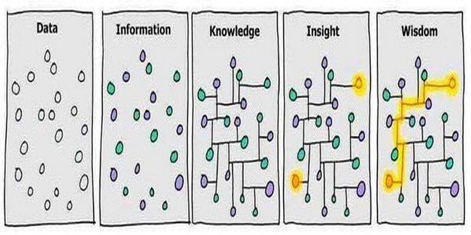

# Knowledge Cycle

When you first start using your PKB, it can be tantalizingly tempting to capture everything interesting that you come across.  You end up building a huge collection of articles that you've skimmed, and have built what is essentially a bad version of Wikipedia or Google.  A variety of techniques and systems have emerged to handle this kind of "Personal Knowledge Management":

* [Zettelkasten](https://zettelkasten.de/)
* [Evergreen Notes](https://notes.andymatuschak.org/Evergreen_notes)

In the spirit of [**Be Useful**](../#be-useful), it's worth remembering what _cognitive problem_ you're trying to solve with these practices!  Very few people that we traditionally think of as "very successful" have publicly stated that they use any processes like this.  Indeed, Niklas Luhmann, the creator of the Zettelkasten method, was an extremely prolific writer, and only near the end of his life documented his practices in a couple of small essays that became what we call Zettelkasten today.

It suggests the question: is it Zettelkasten that made Luhmann successful, or is it that he was relentlessly focused on problems he cared about, and _Zettelkasten_ was the set of cognitive processes that he designed for _his_ brain and _his_ problems?

These systems are seductive because writing notes _feels like work_.  You can _see yourself_ filling out holes in your knowledge!  It constantly feels like you're on the verge of achieving a dense enough network of facts and links from which novel insight and value will emerge.  To cut through this, let's revisit some of the general cognitive problems you might be facing, so that you can evaluate how to pick and choose the best parts from these systems for yourself.

### What is Learning?

One of the most salient cognitive problems is the question of _learning_.  What does it mean to do it well? Can we do it faster?  There are a variety of frameworks for thinking about this, such as the [Dreyfus model](https://en.wikipedia.org/wiki/Dreyfus_model_of_skill_acquisition), the [Bloom Taxonomy](https://en.wikipedia.org/wiki/Bloom%27s_taxonomy), the [Benner Progression](https://en.wikipedia.org/wiki/Patricia_Benner), or even the medeival guild progression.  I think it's actually illustrated pretty well in the following meme:

The point is that we start learning about the world by collecting data and observations.  Babies learn language not by being told formal rules of grammar but by copying what people say to them.  Children learn to ride bikes by using training wheels, not by studying the physics of the wheel.  Even when studying advanced abstract mathematics, one of the first things you do is to use _concrete examples_ to illustrate.

On top of this _soup_ of facts, humans _**invent**_ concepts so that we can easily _talk_ about and _work_ with a large collection of facts.  For example, the concept of "fruit" was made up so that we could easily _talk_ about these things that certain plans created in order to reproduce.  Of course, the concepts that _are_ useful get used in multiple contexts \(e.g. botany vs. kitchen\), which results in arguments over whether tomatoes are actually fruit.

As you collect more and more data and knowledge in a particular area, you'll start seeing how disparate parts of a domain are connected, or you may even be able to draw connections across the boundaries that people traditionally place when studying these things in school.

### Novice

> How are we supposed to talk about options strategies if you have to spend 5 seconds thinking about what the payoff for a call option is?

The role of rote practice, while overused in schools, is probably underused by adults.  An appropriately-sized amount of concrete practice or experience can be incredibly important for getting some _actual data_ which will serve as the foundation for knowledge, and then insight.  Skipping this step will generally lead to the kinds of failure we see when someone has clearly only read about something but never actually tried what they read, or when someone tries to reason about a domain they aren't familiar with by analogizing it to their own.  The high-level ideas sound OK, but because no two domains are ever the same, there's always some concrete way in which the ideas won't work.

Therefore, when trying to learn a subject as a _novice_, try using your PKB in the following ways:

* **Soup**.  Create a folder for what you're trying to learn \(e.g. `Biology/` or `Chess/` \) and just start _doing stuff_ and _writing anything that comes to mind down_.  Don't worry too much about whether you're duplicating ideas or have the perfect structure - you are just trying to get some experience and gather enough data to form a reasonable foundation.
* **Synthesis**.  Once you've got some raw material in your folder, you can edit, cut+paste, make new files, move files around, make and remove folders, link ideas together, and create new concepts for relationships shared between different ideas.  The goal here is not to come up with some "perfect structure", but rather to force your brain to _actively engage_ with the connections that you are learning about, so that it actually connects those _concepts_ to _facts._

You'll note that the "end product" of this doesn't _really matter_.  You could just delete it if you wanted to.  Whether or not you used your PKB successfully here depends on whether or not you were able to _import_ and _understand_ the concepts and models that others have proposed, into your own brain.  Your PKB is just a scratch space for you to work with this so you aren't overly constrained by your own working memory.  It gives you a place where you can dive into ideas, jot down your questions, and collate research to answer them to your satisfaction.

### Application

Another problem that we can try to solve is the _application_ of knowledge in an operational setting.  For example, maybe I'm writing some software and want to use a database effectively.  You should _directly target these problems_ with your PKB.  For example:

* **Checklists**.  For concrete tasks that you frequently perform, put together your own list of best practice so that you can rapidly execute while feeling confident you haven't forgotten anything.
* **Primers**.  For general concepts that you need to occasionally think about, write a primer that will serve as a rapid refresh of the core ideas and trade-offs that you should consider.  Generally speaking, these are most useful when written at the level of _concepts, models_, and _techniques_ which tend to encourage a foundational understanding of the subject.

The general point being, having a folder called `Databases/` that contains everything I've ever learned about databases, while it may be useful for some _other_ cognitive problem, is probably not the best way for me to ensure I'm applying my database knowledge effectively while writing software, and if I'm worried about that, I should just _directly solve for it_.  It's **OK** to have different "views" of my database knowledge \(the primer I write could even reference other parts of my PKB\).

### Generation

The seductive nature of collecting knowledge probably lies in the hope of _**generating**_ new insights from the mechanical process of filling out a PKB.  While we're still probably pretty far from a generalized form of algorithmic creativity or insight, it's worth thinking about how you might use your PKB to help you make _new_ connections.


**Concept-based Notes.**  Store your knowledge by what it is, not where you read it.


I strongly agree with Andy Matuschak's second axiom for Evergreen Notes, and much of my PKB is organized around domain \(e.g. `Biology/` \) and then concept \(e.g. `Cell Division` \).  When you run across a concept in different contexts, organizing in this way forces you to bring the notes for these things together, which is a way of "forcing" connections and "serendipity" to occur.  Of course, it requires active curation - you need to have curate concepts at a good level of granularity \(too fine and you'll never have connections, too coarse and the connections will be spurious\), you need to have a workflow for collating your knowledge, etc.


**Embrace Duplication.**  The same knowledge can be useful in different places.


Following the logic in [Hierarchical](../structure/hierarchical.md), it should be obvious that the section of our PKB dedicated to collecting knowledge in order to facilitate generating new insights \("PKM" or Personal Knowledge Management\) is solving a _different_ cognitive problem, than say, helping us [Read](../activities/records.md) effectively, or for learning material as a novice.  I think trying to have your notes solve many cognitive problems simultaneously is a mistake, and that having some redundancy across these different cognitive problems is _perfectly fine_.  I personally have a folder called `Knowledge/` that is very "Evergreen" - lots of timeless notes, heavy concept-orientation - and separate folders for `Reading/` and `Projects/` where I keep very specific notes for things I'm actively working on.

Over time, knowledge will cross-pollinate and migrate back and forth, but having separate areas for working on these different problems helps me _stay focused_.  When I'm working on a project, I can focus on it without constantly trying to connect things to my PKM notes, and handle the cross-pollination at a later time.

